# Haiti

This is my final project on Haiti.

## Administrative Subdivisions of Haiti

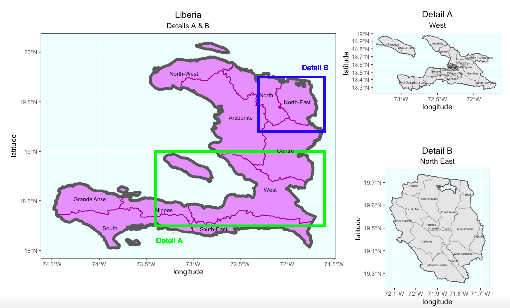

Haiti is divided administratively into 10 departments: Artibonite, Centre, Grand'Anse, Nippes, Nord, Nord-Est, Nord-Ouest, Ouest, Sud-Est and Sud. The country is further subdivied into 42 arrondissements (a specific level of administrative division in Haiti), including Port-au-Prince, Jacmel, Bainet, etc.

The region that I picked is West (Detail A), also known as "Ouest" and North-East (Detail B). Unlike its name indicates, the west department is located in the east part of Haiti. This department includes the capital of Haiti, Port-au-Prince, and thus, is the most populated area among the country due to the relatively developed economy. Like the name tells, the North-East department is located in the northeastern of Haiti, which is a historic site of colonial plantations and a main place for the cultivation of chestnuts.

## Population of Haiti's Countries

According to the bar chart on the left, there's no big difference in the population except for Ouest and L'Artibonite, which accounts for more than 55 percent of population in Haiti, showing the particular area of concentrated population.

## Population of Haiti's Districts

According to the population plot above, the most obvious red part is where Haiti's capital Port-au-Prince is located in. Meanwhile, due to the impact of this subdivision, the nearby cities are also having a relatively densed population, compared to other parts. Except for this specific area, population is kind of evenly distributed among the country cause there's no particular difference in color, as shown on the plot.

## Population of Haiti_3D plot

The three-dimentional plot presents the population among the country in a more visible way. From the plot, we can infer that except for West and the department around it, the population is mostly distributed in an even way. 

## Histograms with different variables

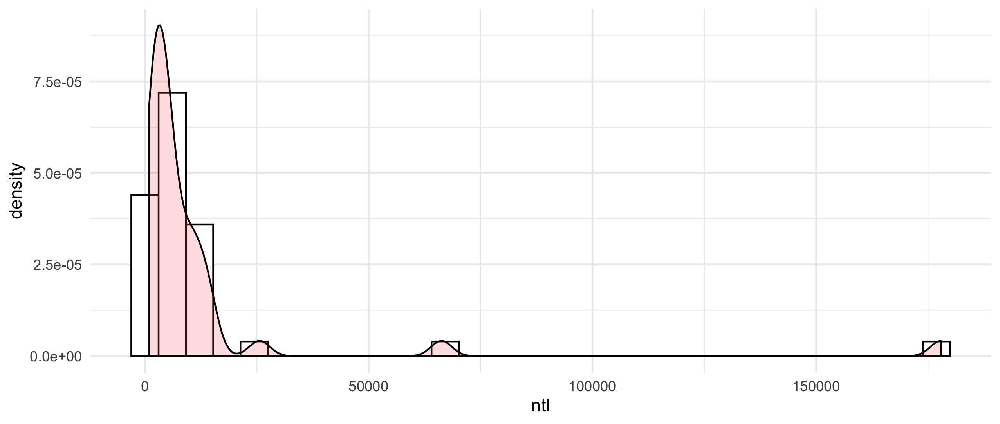
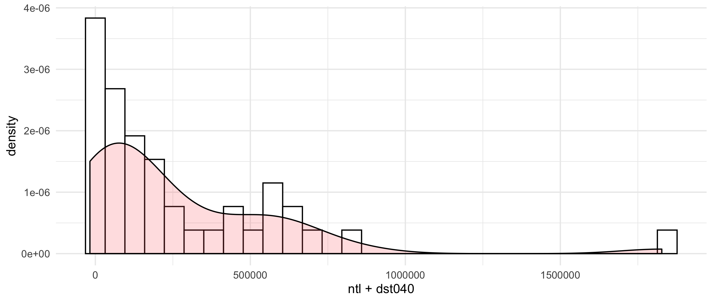
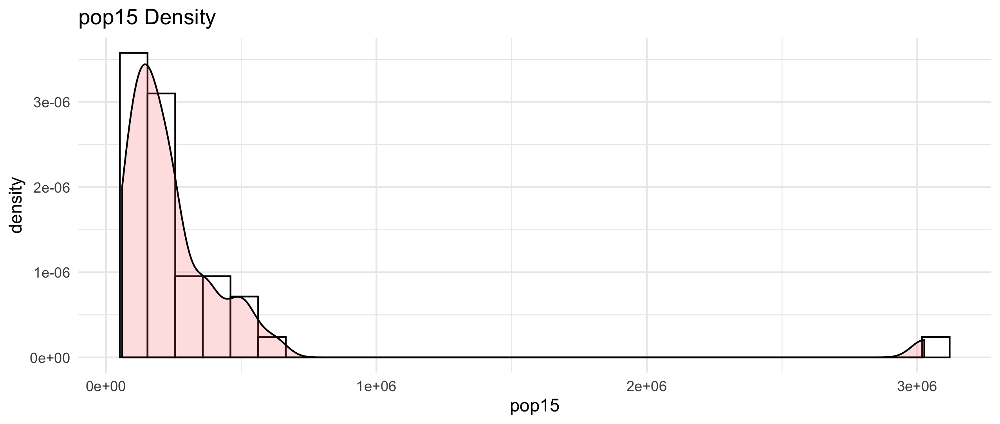

Two histograms with variables indicate that there's one region with particularly high use of night time lights, further confriming the previous estimated of population.

## The Regression Model

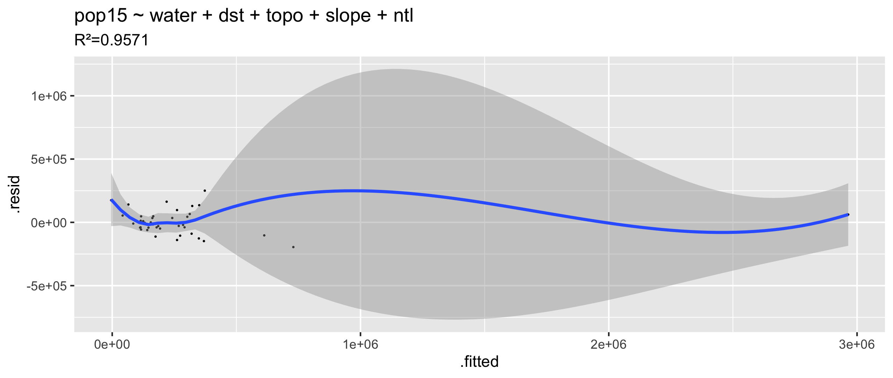
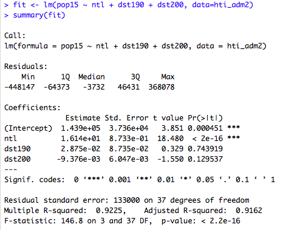

The R square value I got is very close to 1, which shows the accuracy of the estimated method. However, this might also be due to the size of data collected is relatively small compared to other country's.

## Mapview

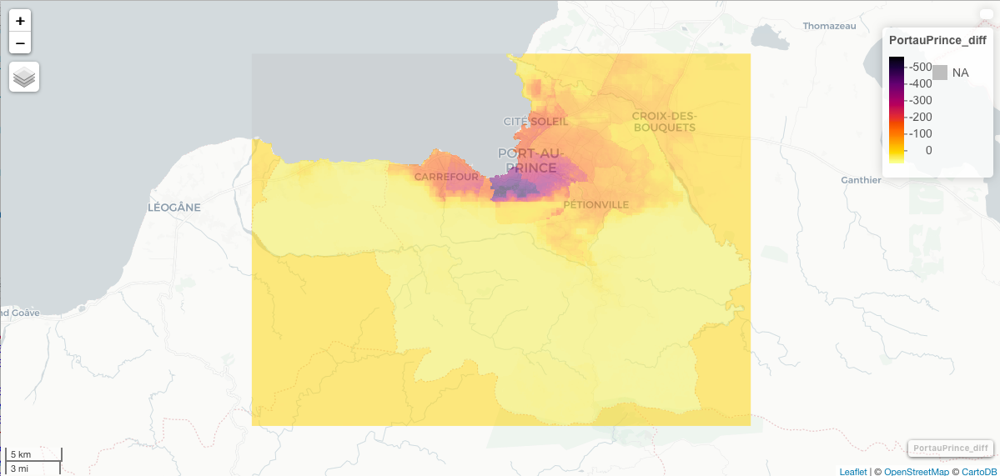

## 1st Model - means model
Response variable is population and the predictors are mean of covariates:

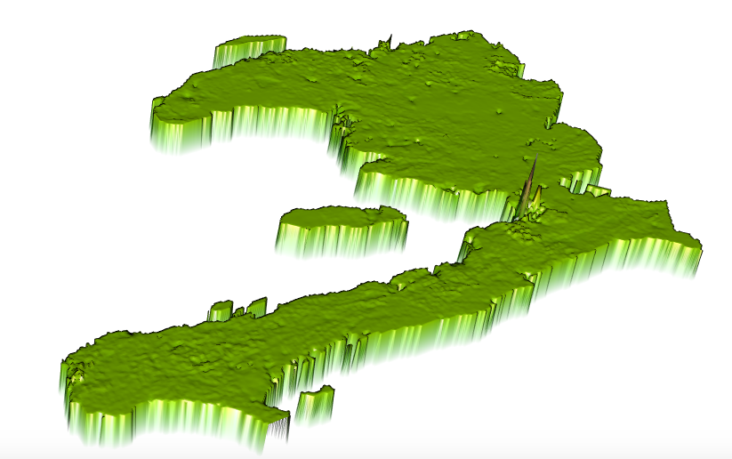
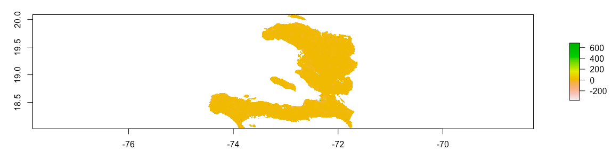

## 2nd Model - sums model
Response variable is population and the predictors are sums of covariates:

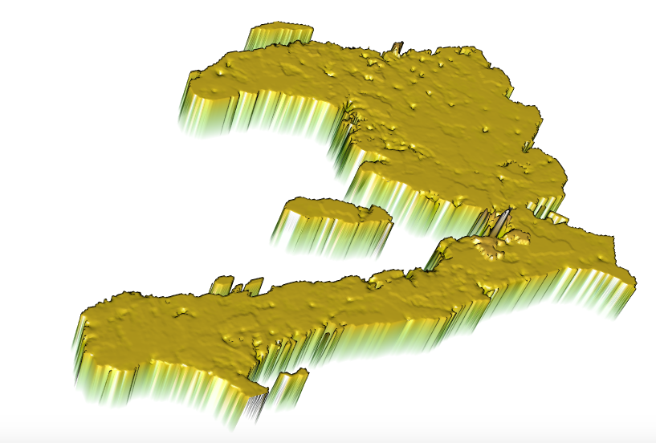
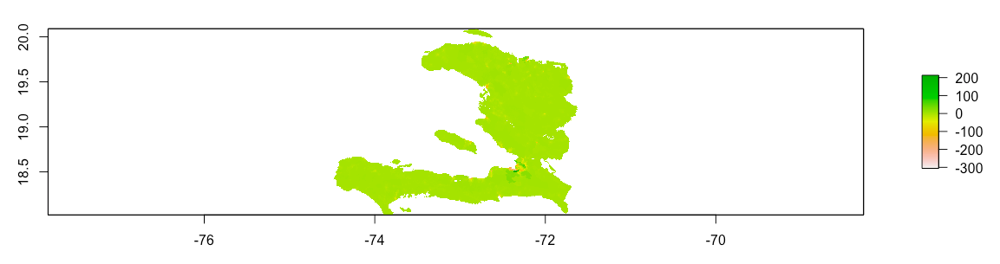	

## 3rd Model - log model
Response variable is log of population and the predictors are mean of covariates:

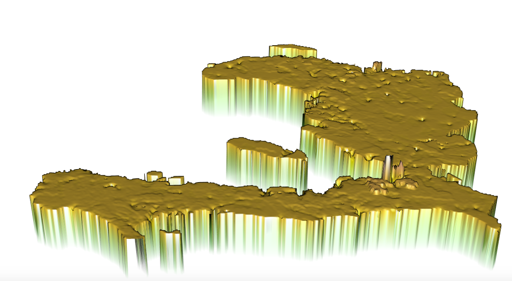
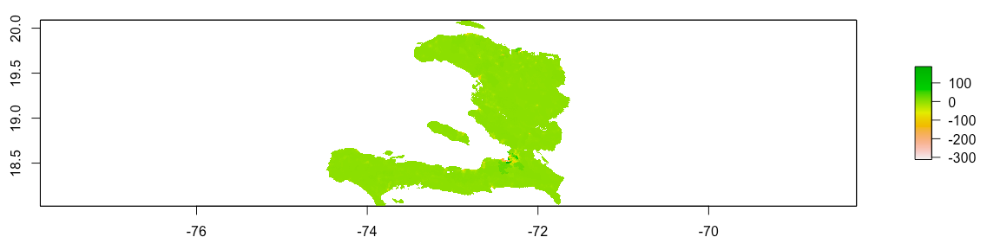

## Comparison

Even though the third model gives the smallest r² value (0.3941), compared to the sums model’s (0.7354) and means model’s (0.7859). However, r² value focuses on the general similarity of the predicted and actual population. On the other hand, absolute difference quantifies the difference into a specific number, thus playing a more important role in determining the accuracy of the prediction. Also, by comparing the specific quantified difference in the actual population and the predicted population, scientists can have a better and thorough sense of various models. The absolute difference for the logarithm model is 8910645, which is slightly lower than the sums model, which has a difference of 8937638. Meanwhile, it is millions smaller than the difference yield by the means model, which is 10732289. In conclusion, the model of using the logarithm of the population as the response variable and using the mean of covariates as the predictor (the third model) yields the best results.

## Human Settlements & Roadways & Health Care Facilities - Data

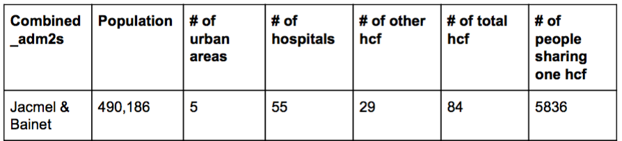

## Human Settlements & Roadways & Health Care Facilities - Data

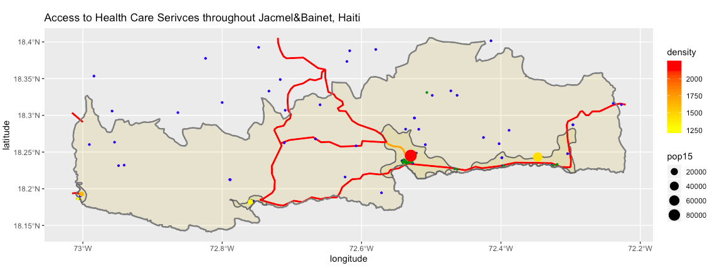

## Human Settlements & Roadways & HealthCare Facilities - 3D Plot

Urban Areas: The main urban areas “Cité Lumiere de Jacmel” in Jacmel is located on a flat ground - a low laying area. The terrain there is relatively flat, which is conducive to the construction of infrastructure such as buildings and roads. Moreover, the water source is sufficient, contributing to a more stable agricultural condition and a more convenient water transportation system.

Roadways: Because of the low rate of ownership, the type of roadways is limited, as there are only secondary roads in the city. Also, the catastrophic earthquake in 2010 has damaged, or even destroyed, some roads. Some of roads are built on the mountainous areas, but most of them are built on flat grounds, connecting each urban areas and health facilities. The roads are built in ways to maximize people's accesibility to health care facilities.

Health Care Facilities: Most of the health care facilities are built on relatively flat areas or on the ridge, rather than being built right on top of the hill. It might be built in this pattern in order to improve people’s accessibility to hospitals, clinics, etc. Also, another feature is that most of health care facilities are connected by the major secondary roads (colored in red on the plot), resulting in convenient path towards those facilities.

The State of Health Care: Unlike other low or middle income countries, the main problem related to health care is not the lack of hospitals, but is a dearth of primary care and a lack of public investment in health care facitilities. Specifically, the annual per capita public health spending in Haiti is only $13, whereas it's $180 in the Dominican Republic, Haiti's neibor country. At the same time, lots of hospitals are not providing level of services that they are supposed to have. So the number of hospitals (55) is deceptive because it is unable to show the true state of health care that people can be serviced.

