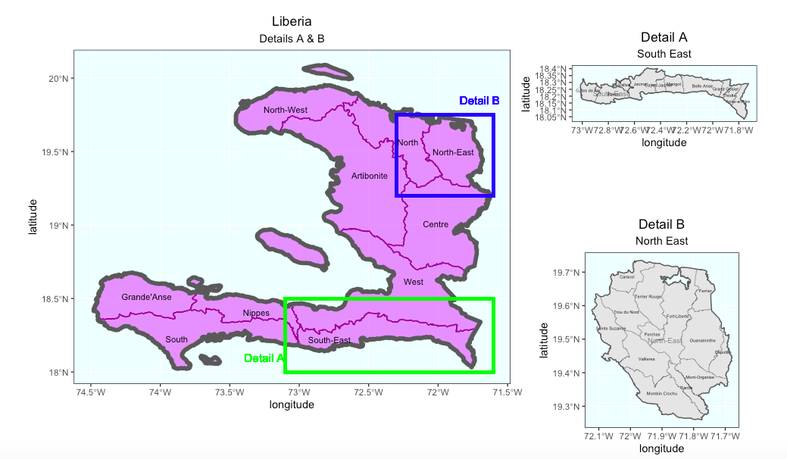
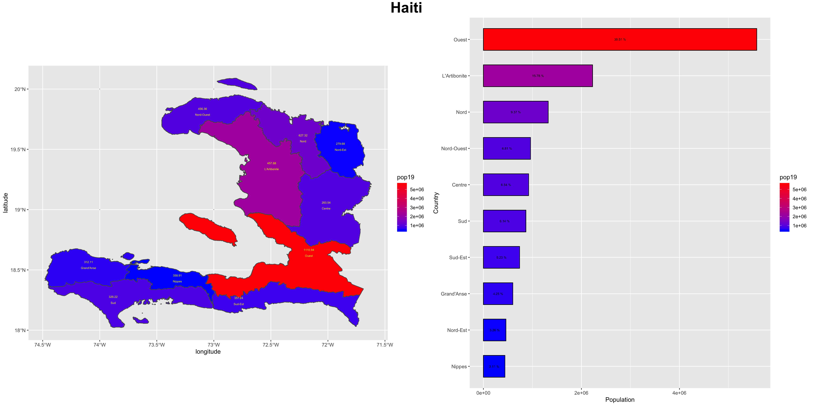
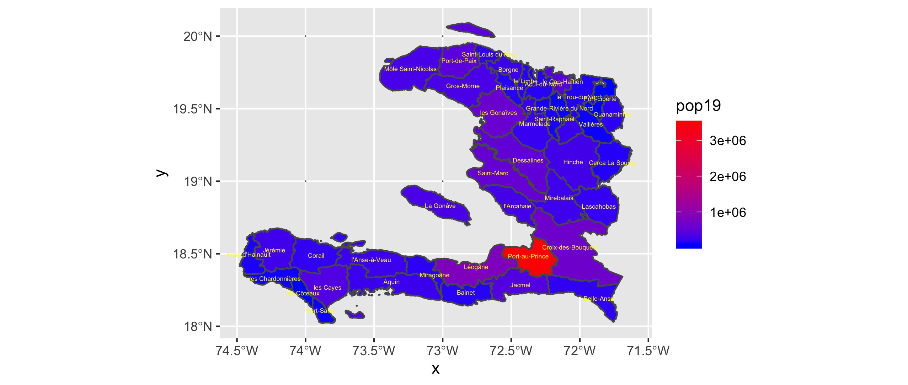

# Haiti

This is my final project on Haiti.

## Administrative Subdivisions of Haiti

Haiti is divided administratively into 10 departments: Artibonite, Centre, Grand'Anse, Nippes, Nord, Nord-Est, Nord-Ouest, Ouest, Sud-Est and Sud. The country is further subdivied into 42 arrondissements (a specific level of administrative division in Haiti), including Port-au-Prince, Jacmel, Bainet, etc.

The region that I picked is South-East (Detail A) and North-East (Detail B). Like its name indicates, South-East department  is located in the southeastern part of Haiti. This department includes two specific countries which This department is the populated area among the country due to its relatively developed economic development. Also as the name tells, the North-East department located in the northeastern of Haiti, which is a historic site of colonial plantations and a main place for the cultivation of chestnuts.

## Population of Haiti's Countries

According to the bar chart on the left, there's no big difference in the population except for 

## Population of Haiti's Districts

According to the population plot above, the most obvious red part is where Haiti's capital Port-au-Prince is located in. Meanwhile, due to the impact of this subdivision, the nearby cities are also having a relatively densed population, compared to other parts. Except for this specific area, population is kind of evenly distributed among the country cause there's no particular difference in color, as shown on the plot.

## Population of Haiti_3D plot

